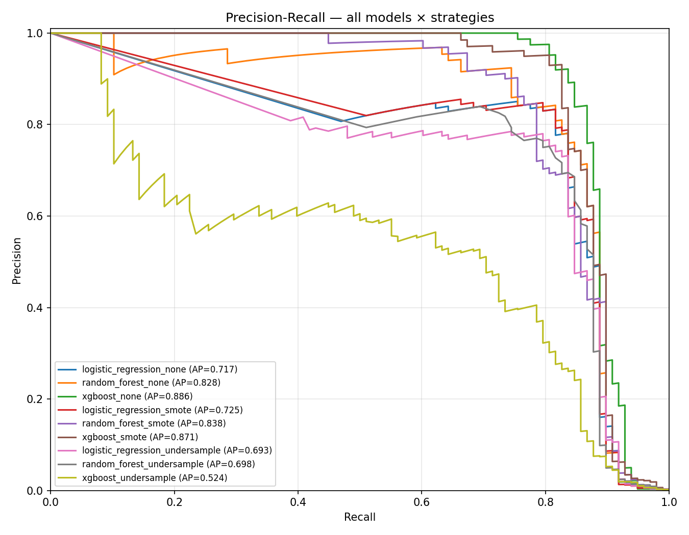
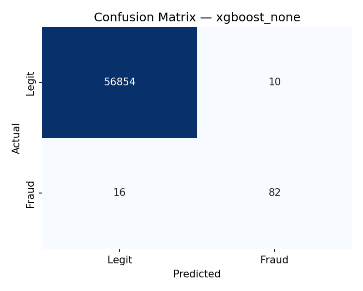

# Results

> XGBoost trained with class weights reaches **0.8857 average precision** on the Kaggle credit card fraud dataset, beating SMOTE oversampling and random undersampling for the strongest model in the lineup. Random undersampling collapses performance, and the model with the most capacity loses the most.

## The experiment

Three models (logistic regression, random forest, XGBoost), each trained under three imbalance-handling strategies: balanced class weights, SMOTE oversampling, and random undersampling. Nine fits in total, evaluated against the same held-out test set.

## Setup

Dataset: Kaggle `mlg-ulb/creditcardfraud`. 284,807 transactions, 492 fraud (0.173%). Features V1–V28 are anonymized PCA components; Time and Amount are raw and get a `RobustScaler` because Amount is heavy-tailed.

Split: 80/20 stratified, fraud rate preserved (0.1729% train, 0.1720% test). Resampling is applied only to training data. The test set stays at the natural fraud rate so the metrics reflect what production would actually see.

Primary metric: average precision (PR-AUC). F1, precision, and recall are reported at threshold 0.5 as a sanity check on what you'd get out of the model without tuning. ROC-AUC is deliberately ignored: at a 0.17% positive rate, ROC curves are misleadingly optimistic. A model can score 0.99 ROC-AUC and still flag mostly false positives. Precision-recall doesn't have that problem.

## Results

| Model | Strategy | AP | F1 | Precision | Recall |
|---|---|---:|---:|---:|---:|
| xgboost | none | **0.8857** | **0.8632** | 0.8913 | 0.8367 |
| xgboost | smote | 0.8713 | 0.8000 | 0.7664 | 0.8367 |
| random_forest | smote | 0.8376 | 0.6614 | 0.5385 | 0.8571 |
| random_forest | none | 0.8284 | 0.8290 | 0.8421 | 0.8163 |
| logistic_regression | smote | 0.7251 | 0.1106 | 0.0589 | 0.9184 |
| logistic_regression | none | 0.7175 | 0.1142 | 0.0609 | 0.9184 |
| random_forest | undersample | 0.6979 | 0.0808 | 0.0422 | 0.9184 |
| logistic_regression | undersample | 0.6933 | 0.0737 | 0.0384 | 0.9184 |
| xgboost | undersample | 0.5243 | 0.0655 | 0.0340 | 0.9184 |

## Findings

### 1. Class weights beat SMOTE on the model that matters

XGBoost with class weights wins by 0.0144 AP over XGBoost with SMOTE. For random forest and logistic regression, SMOTE wins, but only by ~0.008 AP, which is well within run-to-run noise on a single split.

The intuition: there are about 400 real fraud examples in the training set, and they're already diverse across 30 dimensions. SMOTE generates synthetic minority points by interpolating between nearest fraud neighbors, but most of those new points land on top of existing clusters. They add density without adding information. A high-capacity model like XGBoost is sensitive enough to overfit those synthetic points slightly, which costs it real performance.

The simpler approach, leaving the data alone and adjusting the loss function instead, wins where it counts. That isn't always true. On this dataset it is.

### 2. Random undersampling collapses performance, and the strongest model suffers most

Undersampling reduces the training set from 227,845 rows to 788 rows (394 fraud + 394 legit, the minimum needed to balance). The performance drop is severe across the board, but the way it's distributed is the surprising part:

- XGBoost: 0.8857 → 0.5243 AP (−41%)
- Random forest: 0.8284 → 0.6979 AP (−16%)
- Logistic regression: 0.7175 → 0.6933 AP (−3%)

The model with the most capacity, XGBoost, the winner on full data, becomes the worst model under undersampling. Logistic regression, the weakest model on full data, barely loses anything.

This makes sense once you frame it as a capacity-vs-data ratio problem. Boosted trees have enormous capacity to learn rich feature interactions, but they need data to do it. Given 788 training rows, XGBoost overfits and fails to generalize to the 56,962-row test set. Logistic regression is rigid enough that it can't overfit that hard, so it loses less by accident.

The other thing to notice: every undersampled model converges to recall ≈ 0.92 with precision ≈ 0.04. They flag huge fractions of the test set as fraud. This is prior shift. The models were trained on data where fraud was 50% of the rows, never re-calibrated to the true 0.17% prior, and their probability outputs are systematically biased toward "fraud."

The lesson: don't undersample when you have plenty of majority class data. Class weights are free, and they don't throw any signal away.

### 3. Average precision and F1 can disagree, and you should know which you're optimizing

Random forest with SMOTE has the third-best AP (0.8376) but the fourth-best F1 (0.6614). It outranks plain random forest on AP and gets beaten by it on F1. Same model family, same dataset, different rankings depending on the metric.

What this means: AP is the area under the precision-recall curve, so it captures the model's underlying discriminative ability across every possible decision threshold. F1 is one point on that curve, evaluated at threshold 0.5. RF+SMOTE has good ranking ability but is poorly calibrated at the default cutoff. Its 0.5 threshold is wrong for the production trade-off you'd actually want.

The fix is threshold tuning, not model rejection. If you have a business cost ratio for false positives versus false negatives (and a real fraud system always does), you tune the threshold to that ratio rather than letting `>= 0.5` decide for you by accident. The default threshold is a placeholder, not a recommendation.

For the winning model at threshold 0.5: 82 true frauds caught, 16 missed, ~10 false alarms, ~56,854 correctly cleared transactions out of 56,962 in the test set.

## Limitations

- **Single train/test split.** K-fold cross-validation would tighten the AP estimates and make the smaller margins in Finding 1 statistically meaningful instead of suggestive.
- **Default hyperparameters.** No Optuna, no grid search. Tuning would likely close some of the gaps between models.
- **Threshold fixed at 0.5.** The API uses 0.5 because nothing better was specified. A real deployment needs a business cost ratio.
- **Random split, not chronological.** Production fraud has concept drift. This dataset is 48 hours of transactions and the split ignores time entirely.
- **PCA features are anonymized.** Feature-level interpretation isn't possible. SHAP would give per-prediction importances but the components themselves stay opaque.

## Reproducibility

Results are deterministic given `RANDOM_SEED = 42` in `src/config.py`. Run `scripts/run_pipeline.py` from PyCharm; expected end-to-end runtime is about 90 seconds on a modern laptop.

## Where to look next

- `notebooks/01_eda.ipynb` — exploratory analysis (renders inline on GitHub)
- `src/preprocess.py` — the three resampling strategies in one function
- `src/train.py` — the trainers with the `use_balanced` flag
- `scripts/run_pipeline.py` — the orchestration loop
